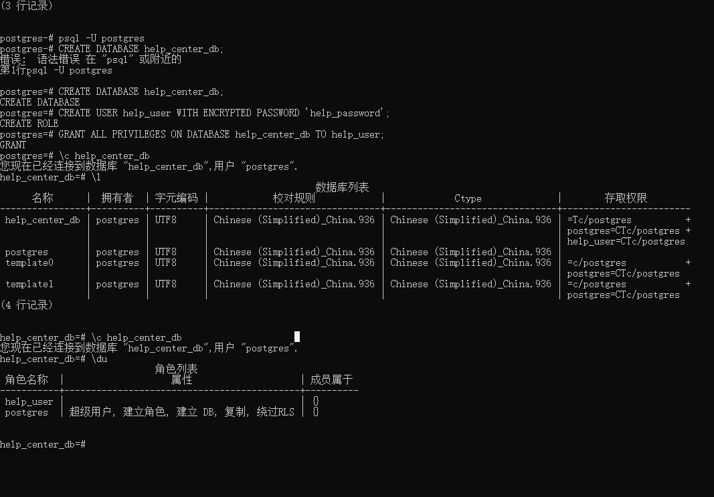

<br/>

1. 确保你以 `postgres` 用户身份登录到 PostgreSQL：

```sh
psql -U postgres
```

2. 创建数据库和用户：

```sql
-- 创建数据库
CREATE DATABASE zlink_helpcenter;

-- 创建用户
CREATE USER help_user WITH ENCRYPTED PASSWORD 'help_password';

-- 给用户赋予数据库的所有权限
GRANT ALL PRIVILEGES ON DATABASE zlink_helpcenter TO help_user;
```

3. 切换到新创建的数据库：

```sh
\c help_center_db
```

以下是每个步骤的详细命令，确保每条命令后都有一个分号：

```sql
-- 创建数据库
CREATE DATABASE help_center_db;

-- 创建用户
CREATE USER help_user WITH ENCRYPTED PASSWORD 'help_password';

-- 给用户赋予数据库的所有权限
GRANT ALL PRIVILEGES ON DATABASE help_center_db TO help_user;

-- 切换到新创建的数据库
\c help_center_db
```

如果仍然遇到问题，请确保数据库已经成功创建：

```sql
-- 列出所有数据库
\l
```

如果 `help_center_db` 不在列表中，意味着数据库创建步骤可能存在问题。

### 整个过程的示例

1. 登录 PostgreSQL：

```sh
psql -U postgres
```

2. 执行以下命令：

```sql
CREATE DATABASE zlink_helpCenter;
CREATE USER help_user WITH ENCRYPTED PASSWORD 'help_password';
GRANT ALL PRIVILEGES ON DATABASE zlink_helpCenter TO help_user;
\c help_center_db
```

每个命令应该输出类似于以下的信息：

```sql
CREATE DATABASE
CREATE ROLE
GRANT
You are now connected to database "help_center_db" as user "postgres".
```

### 验证数据库和用户

你可以使用以下命令来验证数据库和用户是否正确创建：

```sql
-- 列出所有数据库
\l

-- 切换到新创建的数据库
\c help_center_db

-- 列出所有用户
\du
```

通过这些步骤，你应该能够成功创建并切换到新的数据库。如果仍有问题，请提供更多详细信息以便进一步诊断。

<br/>

