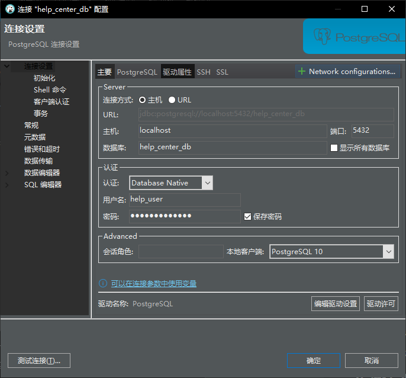

为了创建帮助中心数据库，你需要创建两张表：`help_documents` 和 `categories`。以下是详细步骤：

### 1. 使用超级用户登录 PostgreSQL

打开命令行并使用超级用户身份登录 PostgreSQL：

```sh
psql -U postgres
```

### 2. 创建数据库和用户

创建数据库 `help_center_db` 及其用户：

```sql
-- 创建数据库
CREATE DATABASE help_center_db;

-- 创建用户
CREATE USER help_user WITH ENCRYPTED PASSWORD 'help_password';

-- 给用户赋予数据库的所有权限
GRANT ALL PRIVILEGES ON DATABASE help_center_db TO help_user;
```

### 3. 创建表结构

切换到刚刚创建的数据库并创建所需的表：

```sh
\c help_center_db
```

创建 `categories` 和 `help_documents` 表：

```sql
-- 创建分类表
CREATE TABLE categories (
    id SERIAL PRIMARY KEY,
    parent_id INT,
    order_number INT,
    name VARCHAR(255)
);

-- 创建帮助文档表
CREATE TABLE help_documents (
    id SERIAL PRIMARY KEY,
    title VARCHAR(255),
    content TEXT,
    attachment VARCHAR(255),
    display_position INT,
    status BOOLEAN,
    created_at TIMESTAMP DEFAULT CURRENT_TIMESTAMP,
    updated_at TIMESTAMP DEFAULT CURRENT_TIMESTAMP,
    category_id INT,
    CONSTRAINT fk_category
      FOREIGN KEY(category_id) 
      REFERENCES categories(id)
);
```

### 4. 在 Spring Boot 项目中配置 PostgreSQL

在你的 Spring Boot 项目中，配置 `application.properties` 或 `application.yml` 文件以连接到 PostgreSQL 数据库。

#### application.properties

```properties
spring.datasource.url=jdbc:postgresql://localhost:5432/help_center_db
spring.datasource.username=help_user
spring.datasource.password=help_password
spring.datasource.driver-class-name=org.postgresql.Driver

spring.jpa.hibernate.ddl-auto=update
spring.jpa.show-sql=true
spring.jpa.properties.hibernate.dialect=org.hibernate.dialect.PostgreSQLDialect
```

### 5. 添加 PostgreSQL 依赖

在你的 `build.gradle` 文件中添加 PostgreSQL 驱动的依赖。

```groovy
dependencies {
    implementation 'org.springframework.boot:spring-boot-starter-data-jpa'
    implementation 'org.springframework.boot:spring-boot-starter-web'
    runtimeOnly 'org.postgresql:postgresql'
    testImplementation 'org.springframework.boot:spring-boot-starter-test'
}
```

### 6. 创建实体类和仓库接口

#### 实体类

```java
package com.example.helpcenter.model;

import javax.persistence.*;
import java.io.Serializable;
import java.util.Date;

@Entity
@Table(name = "help_documents")
public class HelpDocument implements Serializable {
    @Id
    @GeneratedValue(strategy = GenerationType.IDENTITY)
    private Long id;

    private String title;
    
    @Lob
    private String content;

    private String attachment;

    private Integer displayPosition;

    private Boolean status;

    @Column(name = "created_at", nullable = false, updatable = false)
    @Temporal(TemporalType.TIMESTAMP)
    @org.hibernate.annotations.CreationTimestamp
    private Date createdAt;

    @Column(name = "updated_at")
    @Temporal(TemporalType.TIMESTAMP)
    @org.hibernate.annotations.UpdateTimestamp
    private Date updatedAt;

    @ManyToOne
    @JoinColumn(name = "category_id")
    private Category category;

    // Getters and Setters
}

@Entity
@Table(name = "categories")
public class Category implements Serializable {
    @Id
    @GeneratedValue(strategy = GenerationType.IDENTITY)
    private Long id;

    private Integer parentId;

    private Integer orderNumber;

    private String name;

    // Getters and Setters
}
```

#### 仓库接口

```java
package com.example.helpcenter.repository;

import com.example.helpcenter.model.HelpDocument;
import org.springframework.data.jpa.repository.JpaRepository;
import org.springframework.stereotype.Repository;

@Repository
public interface HelpDocumentRepository extends JpaRepository<HelpDocument, Long> {
}

package com.example.helpcenter.repository;

import com.example.helpcenter.model.Category;
import org.springframework.data.jpa.repository.JpaRepository;
import org.springframework.stereotype.Repository;

@Repository
public interface CategoryRepository extends JpaRepository<Category, Long> {
}
```

### 7. 使用 DBeaver 连接 PostgreSQL

1. 打开 DBeaver，点击左上角的 "新建连接" 图标。
2. 选择 "PostgreSQL" 并点击 "下一步"。
3. 输入你的数据库连接信息：
   - Host: localhost
   - Port: 5432
   - Database: help_center_db
   - Username: help_user
   - Password: help_password
4. 点击 "测试连接" 以确保连接成功，然后点击 "完成"。



<br/>

### 8. 运行 Spring Boot 应用

确保你的 Spring Boot 应用可以成功连接到 PostgreSQL 数据库并能够进行 CRUD 操作。

```java
package com.example.helpcenter;

import org.springframework.boot.SpringApplication;
import org.springframework.boot.autoconfigure.SpringBootApplication;

@SpringBootApplication
public class HelpCenterApplication {
    public static void main(String[] args) {
        SpringApplication.run(HelpCenterApplication.class, args);
    }
}
```

### 总结

通过以上步骤，你可以将 PostgreSQL 数据库与 Spring Boot 项目关联起来，并使用 DBeaver 进行数据库管理。这样你可以在 Spring Boot 应用中进行数据的持久化操作，并使用 DBeaver 来方便地查看和管理数据库中的数据。
